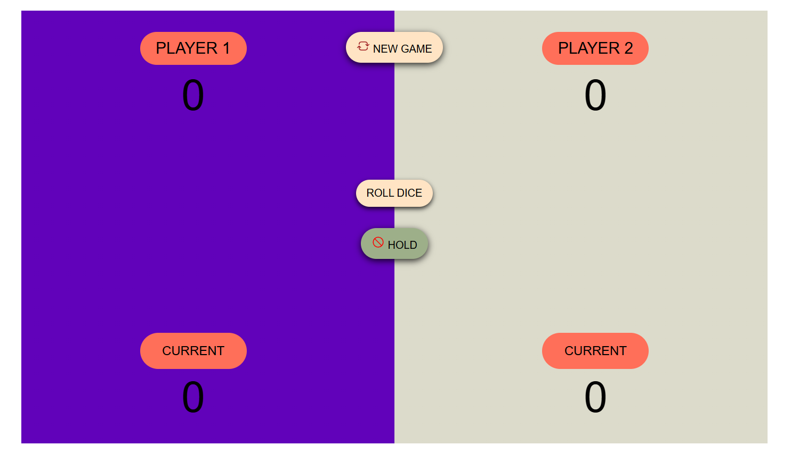

# 🎲 Pig Dice Game

A fun and interactive two-player dice game built using **HTML**, **CSS**, and **JavaScript**. This project demonstrates core concepts of DOM manipulation, event handling, and game logic — all wrapped in a clean and responsive UI.

---

## 🕹️ Gameplay Rules

- The game is played between **two players**.
- Players take turns to **roll a dice**.
- If the player rolls a **2–6**, the number is added to their **current round score**.
- If the player rolls a **1**, their **current round score is reset** and the turn passes to the other player.
- The player can **choose to HOLD** and **add the round score to their total score**.
- First player to reach a set winning score (e.g., **100**) wins the game!

---

## ✨ Features

- 🎮 Two-player mode
- 🎲 Dynamic dice roll with image updates
- 💾 Real-time score tracking
- 🔄 New Game functionality
- 📱 Fully responsive layout
- 🧠 Simple, clean UI with visual feedback

---

## 🛠️ Tech Stack

- **HTML5** – Structure of the game
- **CSS3** – Layout and styling using Grid and Flexbox
- **JavaScript (ES6+)** – Game logic and interactivity

---

## 📸 Screenshots




---

## 🧪 How to Run

1. Clone the repository:
   ```bash
   git clone https://github.com/adityadivine/Pig-Game.git
